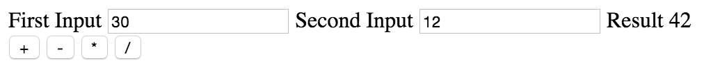

# A Really Basic Calculator

Today, we're going to build a super simple calculator. In and of itself, this might not be very exciting, but consider it a stepping stone to greatness.  It simply accepts two numbers as an input, and when the user clicks a button, it either adds them together, subtracts the second from the first, multiplies them together or divides the first by the second.

[Live Example](https://rawgit.com/ForbesLindesay/tutorials-for-building-real-apps/master/01-basic-calculator/solution/index.html)

Start by building out the basic page, you'll probably want most of the following elements:

 - `<label>` - https://developer.mozilla.org/en-US/docs/Web/HTML/Element/label
 - `<input>` - https://developer.mozilla.org/en-US/docs/Web/HTML/Element/input (pay attention to the `type` attribute)
 - `` - https://developer.mozilla.org/en-US/docs/Web/HTML/Element/span
 - `<button>` - https://developer.mozilla.org/en-US/docs/Web/HTML/Element/button (you might also want to set `type="button"` on this)

Once you've set up your page, add a script tag like ``.  In the JavaScript you'll probably want to use:

 - `document.getElementById` - https://developer.mozilla.org/en-US/docs/Web/API/Document/getElementById
 - `<element>.addEventListener` - https://developer.mozilla.org/en-US/docs/Web/API/EventTarget/addEventListener
 - `parseFloat` - https://developer.mozilla.org/en-US/docs/Web/JavaScript/Reference/Global_Objects/parseFloat

If you get stuck, try posting a question on http://stackoverflow.com/.  Try and be as specific as you can about what you're trying to achieve and what you've tried so far.

Try not to look at the sollution unless you are really really stuck.  It's better to ask on stack overflow for help with the specific problem you're struggling to solve.
