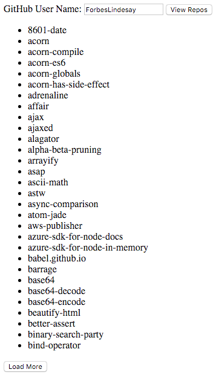

# GitHub Repos

Applications are far more interesting when they allow you to communicate with the outside world.  To do that, we need a way to fetch data from the interent.  In this tutorial we will use the GitHub API to load a list of a given user's repositories.



[Live Example](https://rawgit.com/ForbesLindesay/tutorials-for-building-real-apps/master/03-github-repos/sollution/index.html)

Your app should consist of an input to get a GitHub username, and a button to fetch the list of repositories.  It should then display a list of the names of the user's GitHub repos.

## Part 1

The API docs for fetching GitHub repos are [here](https://developer.github.com/v3/repos/#list-user-repositories) and fortunately this API does not need authentication.  You can use the [github-basic](https://www.npmjs.com/package/github-basic) npm module to access this API from the client.  For example, if I wanted a list of a user's gists I would do something like:

```js
var github = require('github-basic');
var client = github({version: 3});

client.get('/users/:user/gists', {user: 'ForbesLindesay'}).done(function (res) {
  console.dir(res);
}, function (err) {
  console.error('Something went wrong');
  console.error(err.stack);
});
```

## Part 2

You may have noticed that when you type in a user with lots of GitHub repositories (e.g. `ForbesLindesay`) you don't get all the repositories.  This is because the response is paged.  The paging is good because it allows the initial list to load quickly, but we should add a button to get the next page of repositories.  Extending the example above, we could get the first two pages of gists with something like:

```js
var github = require('github-basic');
var client = github({version: 3});

client.get('/users/:user/gists', {user: 'ForbesLindesay'}).done(function (res) {
  console.log('first page:');
  console.dir(res);
  res.getNext().done(function (res) {
    console.log('second page:');
    console.dir(res);
  }, function (err) {
    console.error('Something went wrong');
    console.error(err.stack);
  });
}, function (err) {
  console.error('Something went wrong');
  console.error(err.stack);
});
```

You will need to store `getNext` from each successive response and use it to fetch the next page of data when the user clicks "Load More".

## Bonus

As a bonus, try hiding the "Load More" button when there is no more data (i.e. `getNext` is not a function).  You can use `element.style.display = null;` to hide an element.

Going one step further, you could also disable the "View Repos" and "Load More" button while loading is already in progress.  You can do this using `element.setAttribute('disabled', 'disabled')` and `element.removeAttribute('disabled')`.