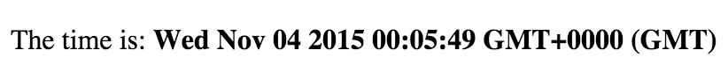

# React Clock

In the last tutorial you may have noticed that applications get complicated really fast once you have to think abpout multiple asynchronous operations and keeping the DOM (HTML) in sync at the same time.

We're going to use React to demonstrate how you might build a re-usable clock component.  The goal here is to minimise our direct interactions with the DOM, and to move from procedurally defining what changes, to declaratively specifying how the app should look in a given state.



[Live Example](https://rawgit.com/ForbesLindesay/tutorials-for-building-real-apps/master/04-react-clock/sollution/index.html)

## HTML

As part of an effort to reduce the number of different parts we need to think about, we're going to move our entire application code into JavaScript.  Your html file should therefore contain:

```html
<!DOCTYPE html>
<html>
  <head>
    <title>GitHub Repos</title>
  </head>
  <body>
    <div id="container"></div>
    <script src="bundle.js"></script>
  </body>
</html>
```

and nothing else. You won't need to edit the HTML file at any point after this.

## Dependencies

For this tutorial you will need to install:

```
npm install react react-dom
```

At the top of your file, you should add:

```js
var React = require('react');
var ReactDOM = require('react-dom');
```

For this tutorial, you will need to use two new functions:

1. `React.createElement(name, attributes, ...children)`
2. `ReactDOM.render(ReactElement, DOMElement)`

## Rendering Demos

Try running the following code (remember to browserify it using the command from tutorial 02-gcd):

```js
var React = require('react');
var ReactDOM = require('react-dom');

var container = document.getElementById('container');

ReactDOM.render(
  React.createElement(
    'p',
    {},
    'This is a paragraph of text with ',
    React.createElement(
      'a',
      {href: 'http://www.example.com'},
      'links to other web sites'
    ),
    ', ',
    React.createElement(
      'b',
      {},
      'some text in bold'
    ),
    ' and ',
    React.createElement(
      'i',
      {},
      'some text in italics'
    )
  ),
  container
);
```

As you should be able to see, this renders a static paragraph of text.  However, we can easilly choose to make any part of the text dynamic.

## Step 1: building a clock

Write a render function that takes the current time (as a human readable string, e.g. "Tue Nov 03 2015 23:37:07 GMT+0000 (GMT)") and renders html like the following:

```html
<p>The time is: <b>Tue Nov 03 2015 23:37:07 GMT+0000 (GMT)</b></p>
```

You can get a string like this using `(new Date()).toString()`.  Using `setInterval` to turn your app into a clock that updates once per second.

Note how it's relatively simple to build the static rendering, and we can reuse this when we make our app dynamic.

## Step 2: a reusable component

What if we wanted to reuse this clock inside a larger app?  We could render the clock as its own little minature react application, inside a single DOM Node, but what if we wanted to reuse it inside an application built in React?  The sollution is custom react elements, aka "classes" or "components".  Try out the following code:

```js
var React = require('react');
var ReactDOM = require('react-dom');

var container = document.getElementById('container');

// create a "class" or "custom react element"
var Counter = React.createClass({
  // the display name is just for debugging purposes, you can ignore it
  displayName: 'Counter',
  
  // custom elements have an internal `this.state` object.  You can set its
  // initial value here
  getInitialState: function () {
    return {
      count: 0
    };
  },
  
  // this is an event handler.  It is called when the button is clicked
  _onClick: function () {
    this.setState({
      count: this.state.count + 1
    });
  },
  
  // the render method is called by react any time something changes,
  // it should return the updated structure of the DOM.
  render: function () {
    return React.createElement(
      'button',
      // this is where we bind the event handler to the button click event
      // unlike with attachEventListener, there is no need to remember to
      // un-bind the event, and no need to worry about it being added multiple
      // times
      {onClick: this._onClick},
      // render the current count as the content of the button
      this.state.count
    );
  }
});

ReactDOM.render(
  React.createElement(Counter, {}),
  container
);
```

See how once we've packaged up the "Counter" button as a reusable component, we can use it almost as if it was a built in type of element.  Custom react elements like this track their state in `this.state`.  Providing you only ever update `this.state` by calling `this.setState`, React knows when it needs to re-render your app.

React provides "lifecycle methods" to allow a custom element to do something when it's mounted or unmounted.  For example, to create a counter that just ticks by once each second:

```js
var React = require('react');
var ReactDOM = require('react-dom');

var container = document.getElementById('container');

var Counter = React.createClass({
  displayName: 'Counter',

  getInitialState: function () {
    return {
      count: 0
    };
  },
  
  // componentDidMount is called when the component has been added to the DOM
  //
  // Use it to initialise anything that's needed for the lifetime of the
  // element
  componentDidMount: function () {
    this._interval = setInterval(function () {
      // note that because we're calling `this.setState`,
      // the function must be "bound"
      this.setState({
        count: this.state.count + 1
      });
    }.bind(this), 1000);
  },
  
  // componetWillMount is called when the component is about to be removed
  // from the DOM.
  //
  // It is important to dispose of anything that was created in
  // `componentDidMount`
  componentWillUnmount: function () {
    clearInterval(this._interval);
  },
  render: function () {
    return React.createElement(
      'p',
      {},
      this.state.count
    );
  }
});

ReactDOM.render(
  React.createElement(Counter, {}),
  container
);
```

See if you can use these ideas to create a "clock" component that updates itself once per second, and can be used by just calling:

```js
ReactDOM.render(
  React.createElement(Clock, {}),
  container
);
```