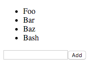

# Expense Tracker

Today we're going to build on what you've learnt so far to create a simple list making app.  We'll use React again, so you shouldn't need to modify the HTML file you used last time.  You also shouldn't touch the DOM manually except for your call to `ReactDOM.render`.



[Live Example](https://rawgit.com/ForbesLindesay/tutorials-for-building-real-apps/master/05-expense-tracker/sollution/index.html)


## Basic Forms

Try out the following example:

```js
var React = require('react');
var ReactDOM = require('react-dom');

var container = document.getElementById('container');

var HelloWorld = React.createClass({
  displayName: 'HelloWorld',

  getInitialState: function () {
    return {
      name: ''
    };
  },

  _onChange: function (e) {
    this.setState({
      name: e.target.value
    });
  },

  _onSubmit: function (e) {
    // by defualt, the form will be sent to the server
    // but we want to handle it in JavaScript
    e.preventDefault();
    alert('Hello ' + this.state.name);
  },

  render: function () {
    return React.createElement(
      'form',
      {onSubmit: this._onSubmit},
      React.createElement(
        'input',
        {
          value: this.state.name,
          onChange: this._onChange
        }
      ),
      React.createElement(
        'button',
        {type: 'submit'},
        'Say Hello'
      )
    );
  }
});

ReactDOM.render(
  React.createElement(HelloWorld, {}),
  container
);
```

Note how instead of reading the value of the input from the input, we store the current value of the input as part of our `HelloWorld` component's state.  This makes it easilly accessible when we submit the form.

## Lists

Try out the following example:

```js
var React = require('react');
var ReactDOM = require('react-dom');

var container = document.getElementById('container');

var ListOfNumbers = React.createClass({
  displayName: 'ListOfNumbers',

  propTypes: {
    max: React.PropTypes.number.isRequired,
  },

  render: function () {
    var numbers = [];
    for (var i = 0; i < this.props.max; i++) {
      numbers.push(i);
    }
    return React.createElement(
      'ul',
      {},
      numbers.map(function (number) {
        return React.createElement(
          'li',
          {key: number},
          number
        );
      })
    );
  }
});

ReactDOM.render(
  React.createElement(ListOfNumbers, {max: 10}),
  container
);
```

Notice two things:

1. custom elements can have properties, accessed via `this.props`.
2. You can render an arbitrary number of children by making one of the children be an Array of elements.  Note also how we set `key` on each `li`.  This is to help react track changes if the list items were re-ordered.

## Your Turn

Now use these two concepts to build a `List` component that has a form underneath it to allow you to type a new item and add it to the list.