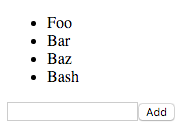

# Rest

Our list writing app from challenge 5 may have been very useful, but what it was really missing was a way to store the lists and share them with other people.



## Required Modules

 - react
 - react-dom
 - express
 - browserify-middleware
 - body-parser
 - then-request

## Serving files

In addition to `res.send`, `express` also provides a helper method for sending entire files: `res.sendFile`.  e.g.

```js
app.get('/example.png', function (req, res, next) {
  // __dirname is the directory of the current file
  res.sendFile(__dirname + '/example.png');
});
```

Use this technique to serve the `index.html` (at `http://localhost:3000/`) file and the `bundle.js` (at `http://localhost:3000/bundle.js`) file from challenge 5.

## Serving browserify bundles

Running browserify on the command line each time we make a tiny alteration is getting tiresome.  We can use `browserify-middleware` to build only the parts that have changed on each request.  e.g.

```js
app.get('/bundle.js', browserify(__dirname + '/index.js'));
```

Set it up so you can just refresh the browser when you edit the contents of `index.js`.  Note that you will still need to restart `server.js` on the command line whenever that changes.

## Serving data

The final method to learn today from the response object is `res.json`.  You can use it to send data from the server to the client.

```js
var items = ['Item a', 'Item b', 'Item c'];

app.get('/items', function (req, res, next) {
  res.json(items);
});
```

Try adding this method then request `http://localhost:3000/items`.

## Fetching data

On the client side, you can load data:

```js
request('GET', '/items').getBody('utf8').then(JSON.parse).done(
  function (items) {
    console.log(items);
  }.bind(this),
  function (err) {
    console.log(err);
  }
);
```

Use this, in the `componentDidMount` lifecycle hook of the list component to load an initial list of items from the server.

## Posting Data

On the server side, use `bodyParser.json()` to accept data.  When requests are made with a method of `put` or `post` they can have bodies, that contain data.

```js
app.put('/items/create', bodyParser.json(), function (req, res, next) {
  console.dir(req.body);
  res.json(items);
});
```

On the client, you can call this code with an item:

```js
request('PUT', '/items/create', {
  json: {item: 'Some Text'}
}).getBody('utf8').then(JSON.parse).done(
  function (items) {
    console.log(items);
  }.bind(this),
  function (err) {
    console.log(err);
  }
);
```

Check that when you call this, the item gets logged on the server side.

## Putting it all together

Now make the client call that method with the appropriate text each time a new item is added, and make the server push the item into the array with each added item.  Now everyone gets the same, shared list.

## Finishing touches

If you open two browser windows, and start adding items in one, you will notice that the second window never updates.  You have two options for fixing this:

1. Add a button to refresh the second list.  When the button is clicked, make a request to the server to load the items again.
2. Set up a timer to poll the server every second or two in order to check for updates.