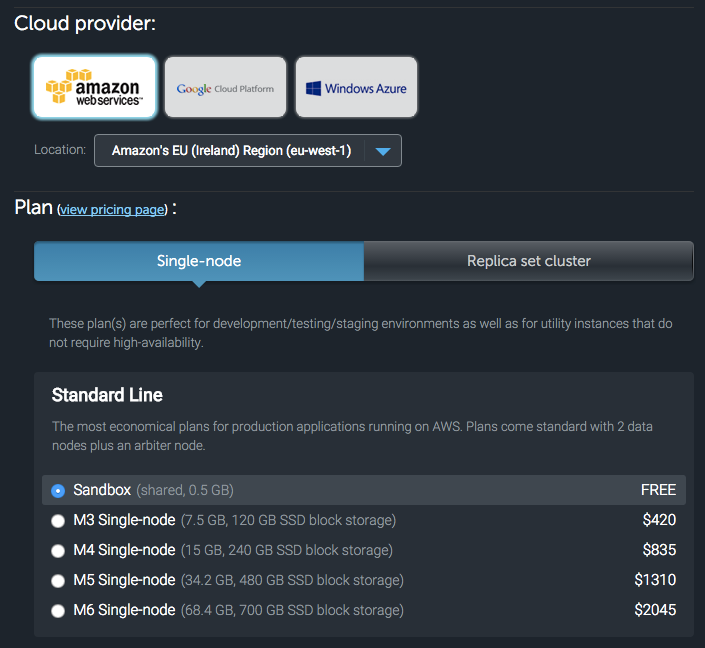

# Mongo

For this tuorial, we're going to look at what to do once we have too much data to just store in a variable on our server, or we want our data to survive even when we reboot the server.

We're going to use https://mongolab.com for this, so sign up for a free account, then create a free database:



After a short delay, you should have a new datbase created.  Look for a connection string that should look something like `mongodb://<dbuser>:<dbpassword>@ds033285.mongolab.com:33285/real-apps`.  Copy this, and create a new user, replacing the `<dbuser>` and `<dbpassword>` sections as appropriate.  This is connection string should then be stored in your secrets.js file.

## Intro

Install `then-mongo` so you can try out a few commands.

```js
var mongo = require('then-mongo');
var secrets = require('./secrets');

// the second argument is a list of collection names
// you can call the collections whatever you want and
// use them to separate different types of object
var db = mongo(secrets.MONGO_DB_CONNECTION, ['items']);

// db.update(query, operation, options)
db.items.update(
  // find the item with "id" "count"
  {
    _id: 'count'
  },
  // increment the "count" property by 1
  {
    $inc: { 'count': 1}
  },
  // if the item doesn't already exist, create it
  {
    upsert: true
  }
).then(function () {
  // read the item with id "count"
  return db.items.findOne({_id: 'count'});
}).done(function (item) {
  console.dir(item, {depth: 10, colors: true});
  // close the connection to the database
  db.close();
});
```

Try running that multiple times.  Observe that the count increases each time.

Documentation for the `$inc` command is at https://docs.mongodb.org/v3.0/reference/operator/update/inc/ and the `update` method is documented at http://mongodb.github.io/node-mongodb-native/2.1/api/Collection.html#update

## Try out what you've learned

Try experimenting with `$set`.  Write one script that calls `$set` to set a property of an object to a string, then write another script to read the string.

It should work by running `node set`, which should set a field to a predetermined string.  Calling `node get` should load the object and log the string out to the console.

## Bonus marks

You can read the arguments from the command line via `process.argv`, which is an array.  The first value in the array is always `node`, the second value is the name of the JavaScript file being run, after that are any args passed in by the user.  See if you can allow setting arbitrary strings using `node set "My String"`
